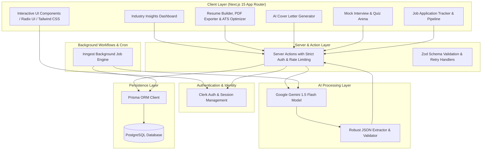
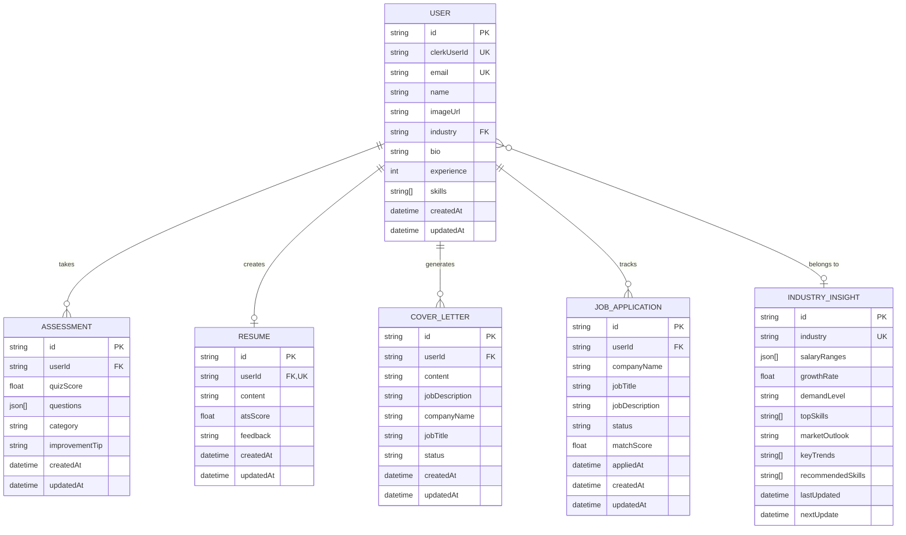
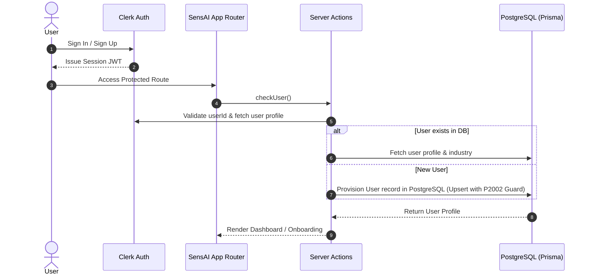
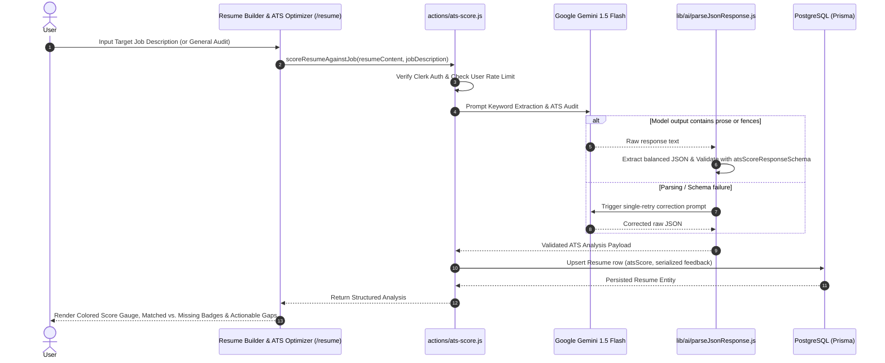
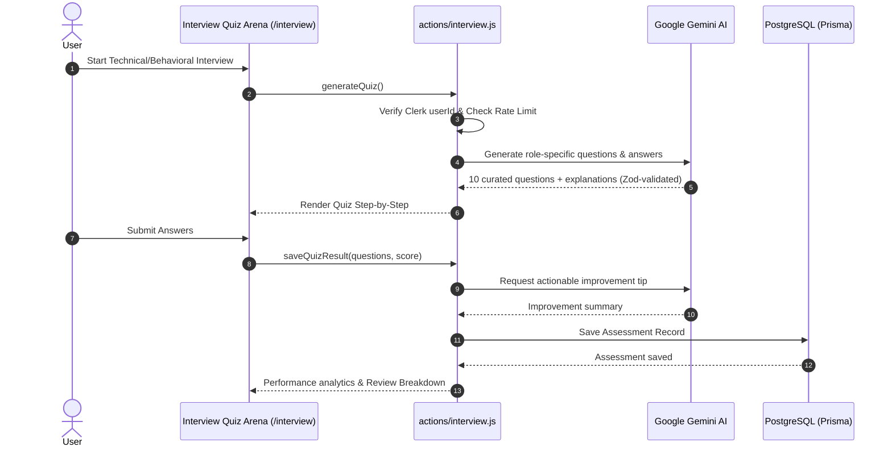
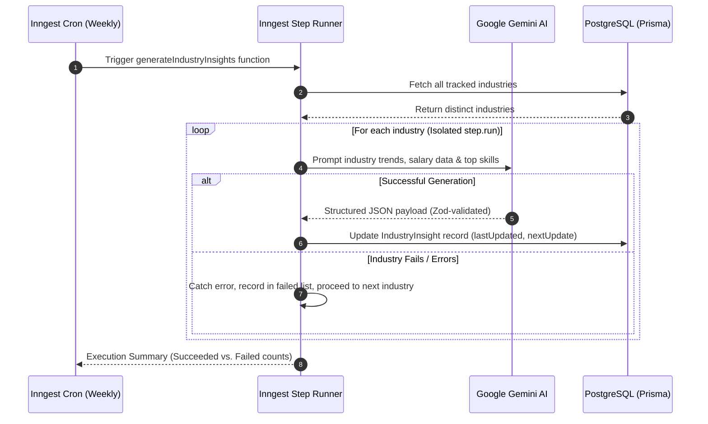

# SensAI — AI-Powered Career Coach

[](https://nextjs.org/)
[](https://react.dev/)
[](https://prisma.io/)
[](https://neon.tech/)
[](https://clerk.com/)
[](https://vitest.dev/)
[](https://github.com/Katakam-Krupavathi)

> **Architected & Developed by Katakam Krupavathi**  
> GitHub: [@Katakam-Krupavathi](https://github.com/Katakam-Krupavathi) &bull; Email: [krupavathikatakam2006@gmail.com](mailto:krupavathikatakam2006@gmail.com)

SensAI is an intelligent, full-stack AI career acceleration platform built with Next.js 15, Google Gemini AI, Prisma ORM, PostgreSQL, Clerk Authentication, and Inngest. It empowers job seekers and professionals with personalized career coaching, dynamic industry insights, AI resume building with ATS scoring, tailored cover letter generation, and interactive mock interview preparation.

---

## 📑 Table of Contents

- [System Architecture](#-system-architecture)
- [Database Schema (Entity Relationship Diagram)](#-database-schema-entity-relationship-diagram)
- [Sequence Diagrams & Workflows](#-sequence-diagrams--workflows)
  - [1. User Authentication & Onboarding](#1-user-authentication--onboarding)
  - [2. AI Resume Builder & Real-time ATS Scoring Engine](#2-ai-resume-builder--real-time-ats-scoring-engine)
  - [3. Interactive AI Mock Interview](#3-interactive-ai-mock-interview)
  - [4. Automated Background Industry Insights](#4-automated-background-industry-insights)
- [Key Features](#-key-features)
- [Project Roadmap & Completed Milestones](#-project-roadmap--completed-milestones)
- [Tech Stack](#-tech-stack)
- [Project Structure](#-project-structure)
- [Environment Configuration & Rate Limiting](#-environment-configuration--rate-limiting)
- [Getting Started](#-getting-started)
- [Author & Maintainer](#-author--maintainer)

---

## 🏛 System Architecture



---

## 🗄 Database Schema (Entity Relationship Diagram)



---

## 🔄 Sequence Diagrams & Workflows

### 1. User Authentication & Onboarding



### 2. AI Resume Builder & Real-time ATS Scoring Engine



### 3. Interactive AI Mock Interview



### 4. Automated Background Industry Insights



---

## 🚀 Key Features

- 🎯 **AI-Powered Industry Insights**: Real-time salary distributions, growth rates, market outlook, and high-demand skill heatmaps updated automatically.
- 🛡️ **Resilient AI Pipeline**: Robust JSON extraction with balanced bracket parsing, strict Zod schema validation, and automatic single-retry fallback on malformed model outputs.
- ⏱️ **Configurable Rate Limiting**: Built-in sliding-window rate limiter protecting Gemini API quotas with clear user-facing cooldown timers.
- 📝 **Smart Resume Builder & ATS Analyzer**: Markdown-supported resume composer with automated ATS compatibility scoring, job keyword matching, role-fit suggestions, and PDF generation.
- ✉️ **Tailored Cover Letter Generator**: Generate highly personalized cover letters aligned with target job descriptions and company backgrounds.
- 🎓 **Interactive Mock Interviews**: Dynamic technical & behavioral quiz engine with instant evaluation, score distributions, and AI improvement tips.
- 💼 **Job Applications Tracker (`/applications`)**: Centralized dashboard to track applied jobs, match scores, interview milestones, and application statuses.
- 🔒 **Enterprise-Grade Security**: Strict Clerk user authentication with multi-factor support, authenticated server actions, and protected API routes.
- ⚡ **Automated Background Workflows**: Inngest-powered recurring cron pipelines ensuring up-to-date market intelligence with per-industry failure isolation.

---

## 📋 Project Roadmap & Completed Milestones

- [x] **Phase 1: Architecture & Authorship Setup**
  - [x] Standardize commit history and attribution under Katakam Krupavathi.
  - [x] Create comprehensive architecture and workflow documentation with Mermaid diagrams.
- [x] **Phase 2: Core User Flow & Onboarding Fixes**
  - [x] Resolve transaction object return bug in `actions/user.js`.
  - [x] Align `OnboardingForm` state handling to trigger automatic redirect to `/dashboard`.
- [x] **Phase 3: Database & Transaction Optimization**
  - [x] Move Gemini LLM network calls outside of database transactions.
  - [x] Eliminate `tx` vs. `db` client mixing inside transaction scopes.
  - [x] Prevent race conditions using `upsert` and unique-constraint (`P2002`) collision guards.
  - [x] Guard `checkUser()` against undefined email addresses.
- [x] **Phase 4: AI Resilience & Output Validation**
  - [x] Implement `lib/ai/parseJsonResponse.js` with balanced bracket extraction and single-retry fallback.
  - [x] Define Zod validation schemas for industry insights, quizzes, and improvement tips.
  - [x] Wrap all Gemini generation endpoints in try/catch with actionable user error surfacing.
- [x] **Phase 5: Background Cron Failure Isolation**
  - [x] Refactor Inngest `generateIndustryInsights` with isolated `step.run` per industry.
  - [x] Prevent individual industry failure from aborting weekly scheduled runs.
- [x] **Phase 6: Sliding-Window Rate Limiting**
  - [x] Build configurable sliding-window rate limiter (`lib/rate-limiter.js`).
  - [x] Apply rate limits across all AI server actions with remaining-time cooldown notifications.
- [x] **Phase 7: Real-Time ATS Scoring Engine**
  - [x] Create `actions/ats-score.js` for job-specific matching and general structural audits.
  - [x] Build interactive `AtsChecker` UI with score gauge, matched/missing keyword badges, and improvement tips.
  - [x] Persist `atsScore` and structured `feedback` to PostgreSQL `Resume` records.
- [x] **Phase 8: Automated Test Suite & Continuous Integration**
  - [x] Configure Vitest test runner with 100% pass rate across AI parser, rate limiter, and ATS modules.
  - [x] Setup GitHub Actions CI workflow for Prisma schema validation and automated testing on PRs.

---

## 💻 Tech Stack

| Domain | Technology |
|---|---|
| **Framework** | [Next.js 15 (App Router, Server Actions)](https://nextjs.org/) |
| **Language** | [JavaScript / React 19](https://react.dev/) |
| **Styling & UI** | [Tailwind CSS](https://tailwindcss.com/), [Radix UI](https://www.radix-ui.com/), [Lucide Icons](https://lucide.dev/) |
| **Artificial Intelligence** | [Google Gemini AI (1.5 Flash)](https://ai.google.dev/) |
| **Database & ORM** | [PostgreSQL (Neon)](https://neon.tech/), [Prisma ORM](https://www.prisma.io/) |
| **Authentication** | [Clerk Authentication](https://clerk.com/) |
| **Background Jobs** | [Inngest Workflow Engine](https://www.inngest.com/) |
| **Testing & CI** | [Vitest](https://vitest.dev/), [GitHub Actions](https://github.com/features/actions) |
| **Charts & Visualization** | [Recharts](https://recharts.org/) |
| **Form Handling** | [React Hook Form](https://react-hook-form.com/), [Zod](https://zod.dev/) |

---

## 📂 Project Structure

```text
SensAI/
├── .github/
│   └── workflows/
│       └── ci.yml            # GitHub Actions CI workflow (Validation & Tests)
├── actions/                  # Next.js Server Actions (Authenticated & Rate-Limited)
│   ├── ats-score.js          # Real-time ATS scoring & job keyword matcher
│   ├── cover-letter.js       # Cover letter generation & management
│   ├── dashboard.js          # Industry insights data fetchers
│   ├── interview.js          # Interview generation & quiz evaluation
│   ├── resume.js             # Resume saving & ATS score calculation
│   └── user.js               # User onboarding & profile management
├── app/                      # Next.js App Router
│   ├── (auth)/               # Clerk Sign-in & Sign-up pages
│   ├── (main)/               # Core authenticated application views
│   │   ├── ai-cover-letter/  # Cover letter generator & preview
│   │   ├── dashboard/        # Industry trends & market analytics
│   │   ├── interview/        # Mock interview simulator & history
│   │   ├── onboarding/       # Industry & profile setup form
│   │   └── resume/           # Resume editor, PDF exporter & ATS optimizer
│   ├── api/inngest/          # Inngest webhook route handler
│   ├── globals.css           # Global Tailwind CSS styles
│   ├── layout.js             # Root layout with Clerk & Theme Provider
│   └── page.js               # Landing page
├── components/               # Reusable React components & UI primitives
│   ├── ui/                   # Radix UI wrapper components
│   ├── header.jsx            # Application navigation bar
│   ├── hero.jsx              # Landing hero section
│   └── theme-provider.jsx    # Dark/Light mode theme provider
├── data/                     # Static configuration & landing page datasets
├── hooks/                    # Custom React hooks (e.g. use-fetch)
├── lib/                      # Core utilities & singleton clients
│   ├── ai/                   # AI response extraction & retry engine
│   │   └── parseJsonResponse.js
│   ├── inngest/              # Inngest client & scheduled functions
│   ├── checkUser.js          # Authenticated user sync helper
│   ├── prisma.js             # Prisma ORM singleton client
│   ├── rate-limiter.js       # Configurable sliding-window rate limiter
│   └── utils.js              # Class merger utilities
├── prisma/                   # Prisma schema & migration files
│   └── schema.prisma         # PostgreSQL data models
├── public/                   # Static assets & illustrations
├── tests/                    # Automated Vitest test suites
│   ├── ai-parser.test.js     # JSON extraction & schema validation tests
│   ├── ats-scoring.test.js   # ATS match & scoring tests
│   └── rate-limiter.test.js  # Sliding-window rate limit tests
├── package.json              # Project dependencies & scripts
└── README.md                 # Architecture documentation
```

---

## ⚙️ Environment Configuration & Rate Limiting

Create a `.env` file in the root directory and configure the following variables:

```env
# Database (PostgreSQL / Neon)
DATABASE_URL="postgresql://<user>:<password>@<host>/<database>?sslmode=require"

# Clerk Authentication
NEXT_PUBLIC_CLERK_PUBLISHABLE_KEY="pk_test_..."
CLERK_SECRET_KEY="sk_test_..."
NEXT_PUBLIC_CLERK_SIGN_IN_URL="/sign-in"
NEXT_PUBLIC_CLERK_SIGN_UP_URL="/sign-up"
NEXT_PUBLIC_CLERK_AFTER_SIGN_IN_URL="/onboarding"
NEXT_PUBLIC_CLERK_AFTER_SIGN_UP_URL="/onboarding"

# Google Gemini AI
GEMINI_API_KEY="your_gemini_api_key_here"

# AI Rate Limiting (Configurable Sliding Window)
AI_RATE_LIMIT_MAX_REQUESTS=10    # Max allowed generations per window (default: 10)
AI_RATE_LIMIT_WINDOW_MINUTES=60  # Sliding window duration in minutes (default: 60)

# Inngest (Background Workflow Engine)
INNGEST_EVENT_KEY="your_inngest_event_key"
INNGEST_SIGNING_KEY="your_inngest_signing_key"
```

### Adjusting Rate Limits
- To increase quota for power users or production scaling, update `AI_RATE_LIMIT_MAX_REQUESTS` (e.g. `25`).
- To adjust the cooldown duration, modify `AI_RATE_LIMIT_WINDOW_MINUTES` (e.g. `30`).

---

## 🛠 Getting Started

### Prerequisites

- **Node.js**: `v18.18.0` or higher
- **npm** or **yarn** / **pnpm**
- **PostgreSQL Database** (e.g., Neon Postgres)
- **Clerk & Google Gemini API Keys**

### Installation

1. **Clone the repository**:
   ```bash
   git clone https://github.com/Katakam-Krupavathi/SensAI-.git
   cd SensAI-
   ```

2. **Install dependencies**:
   ```bash
   npm install
   ```

3. **Generate Prisma Client & Apply Migrations**:
   ```bash
   npx prisma generate
   npx prisma db push
   ```

4. **Run Automated Test Suite**:
   ```bash
   npm test
   ```

5. **Run the Development Server**:
   ```bash
   npm run dev
   ```

6. **Start Inngest Dev Server (Optional for local cron jobs)**:
   ```bash
   npx inngest-cli@latest dev
   ```

Open [http://localhost:3000](http://localhost:3000) in your browser to explore the platform.

---

## 👤 Author & Maintainer

**Katakam Krupavathi**  
- GitHub: [@Katakam-Krupavathi](https://github.com/Katakam-Krupavathi)  
- Email: [krupavathikatakam2006@gmail.com](mailto:krupavathikatakam2006@gmail.com)

