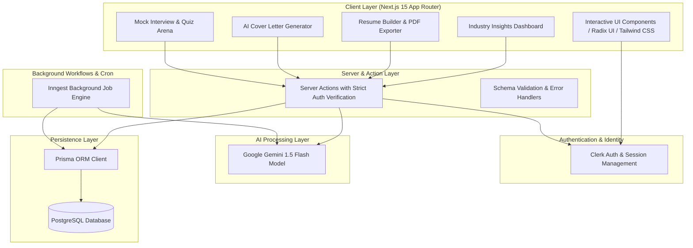
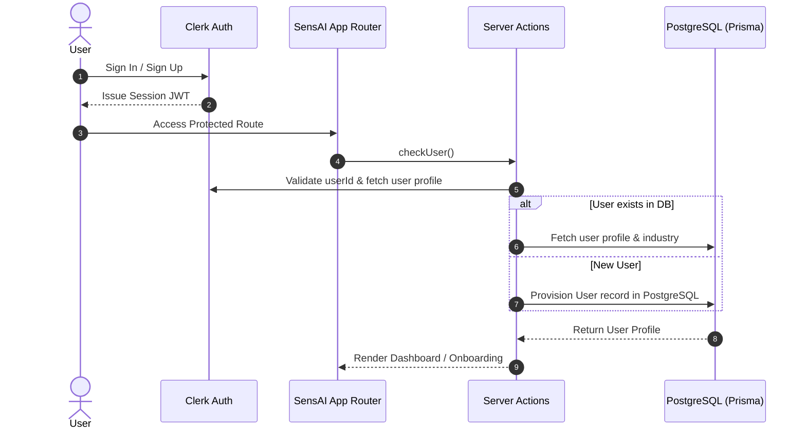
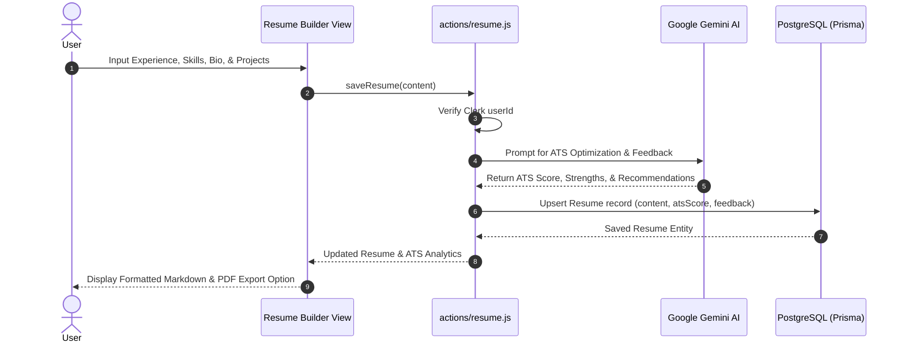
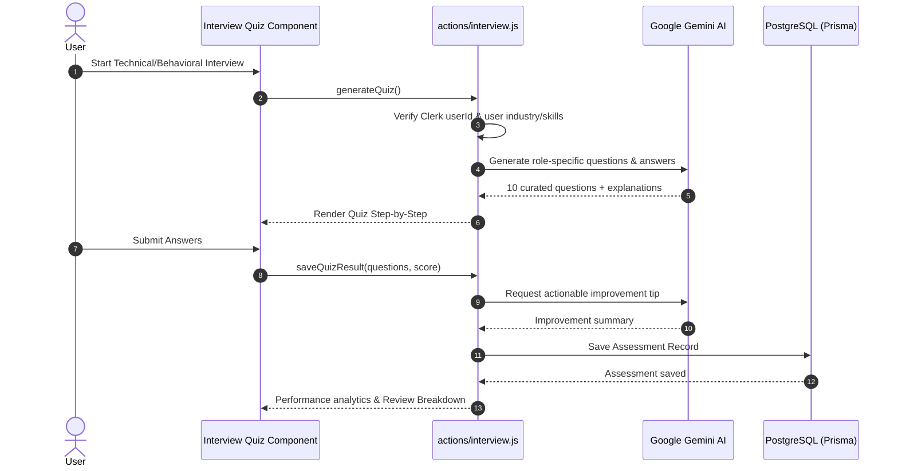
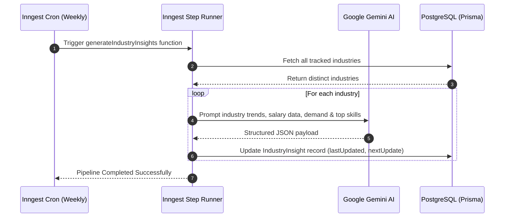

# SensAI — AI-Powered Career Coach

[](https://nextjs.org/)
[](https://react.dev/)
[](https://prisma.io/)
[](https://neon.tech/)
[](https://clerk.com/)
[](https://github.com/Katakam-Krupavathi)

> **Architected & Developed by Katakam Krupavathi**  
> GitHub: [@Katakam-Krupavathi](https://github.com/Katakam-Krupavathi) &bull; Email: [krupavathikatakam2006@gmail.com](mailto:krupavathikatakam2006@gmail.com)

SensAI is an intelligent, full-stack AI career acceleration platform built with Next.js 15, Google Gemini AI, Prisma ORM, PostgreSQL, Clerk Authentication, and Inngest. It empowers job seekers and professionals with personalized career coaching, dynamic industry insights, AI resume building with ATS scoring, tailored cover letter generation, and interactive mock interview preparation.

---

## 📑 Table of Contents

- [System Architecture](#-system-architecture)
- [Sequence Diagrams & Workflows](#-sequence-diagrams--workflows)
  - [1. User Authentication & Onboarding](#1-user-authentication--onboarding)
  - [2. AI Resume Builder & ATS Scoring](#2-ai-resume-builder--ats-scoring)
  - [3. Interactive AI Mock Interview](#3-interactive-ai-mock-interview)
  - [4. Automated Background Industry Insights](#4-automated-background-industry-insights)
- [Key Features](#-key-features)
- [Tech Stack](#-tech-stack)
- [Project Structure](#-project-structure)
- [Environment Configuration](#-environment-configuration)
- [Getting Started](#-getting-started)
- [Author & Maintainer](#-author--maintainer)

---

## 🏛 System Architecture



---

## 🔄 Sequence Diagrams & Workflows

### 1. User Authentication & Onboarding



### 2. AI Resume Builder & ATS Scoring



### 3. Interactive AI Mock Interview



### 4. Automated Background Industry Insights



---

## 🚀 Key Features

- 🎯 **AI-Powered Industry Insights**: Real-time salary distributions, growth rates, market outlook, and high-demand skill heatmaps updated automatically.
- 📝 **Smart Resume Builder & ATS Analyzer**: Markdown-supported resume composer with automated ATS compatibility scoring, role-fit suggestions, and PDF generation.
- ✉️ **Tailored Cover Letter Generator**: Generate highly personalized cover letters aligned with target job descriptions and company backgrounds.
- 🎓 **Interactive Mock Interviews**: Dynamic technical & behavioral quiz engine with instant evaluation, score distributions, and AI improvement tips.
- 🔒 **Enterprise-Grade Security**: Strict Clerk user authentication with multi-factor support, authenticated server actions, and protected API routes.
- ⚡ **Automated Background Workflows**: Inngest-powered recurring cron pipelines ensuring up-to-date market intelligence with zero manual maintenance.

---

## 💻 Tech Stack

| Domain | Technology |
|---|---|
| **Framework** | [Next.js 15 (App Router, Server Actions)](https://nextjs.org/) |
| **Language** | [JavaScript / React 19](https://react.dev/) |
| **Styling & UI** | [Tailwind CSS](https://tailwindcss.com/), [Radix UI](https://www.radix-ui.com/), [Lucide Icons](https://lucide.dev/) |
| **Artificial Intelligence** | [Google Gemini AI (1.5 Flash)](https://ai.google.dev/) |
| **Database & ORM** | [PostgreSQL (Neon)](https://neon.tech/), [Prisma ORM](https://www.prisma.io/) |
| **Authentication** | [Clerk Authentication](https://clerk.com/) |
| **Background Jobs** | [Inngest Workflow Engine](https://www.inngest.com/) |
| **Charts & Visualization** | [Recharts](https://recharts.org/) |
| **Form Handling** | [React Hook Form](https://react-hook-form.com/), [Zod](https://zod.dev/) |

---

## 📂 Project Structure

```text
SensAI/
├── actions/                  # Next.js Server Actions (Authenticated)
│   ├── cover-letter.js       # Cover letter generation & management
│   ├── dashboard.js          # Industry insights data fetchers
│   ├── interview.js          # Interview generation & quiz evaluation
│   ├── resume.js             # Resume saving & ATS score calculation
│   └── user.js               # User onboarding & profile management
├── app/                      # Next.js App Router
│   ├── (auth)/               # Clerk Sign-in & Sign-up pages
│   ├── (main)/               # Core authenticated application views
│   │   ├── ai-cover-letter/  # Cover letter generator & preview
│   │   ├── dashboard/        # Industry trends & market analytics
│   │   ├── interview/        # Mock interview simulator & history
│   │   ├── onboarding/       # Industry & profile setup form
│   │   └── resume/           # Resume editor & ATS evaluator
│   ├── api/inngest/          # Inngest webhook route handler
│   ├── globals.css           # Global Tailwind CSS styles
│   ├── layout.js             # Root layout with Clerk & Theme Provider
│   └── page.js               # Landing page
├── components/               # Reusable React components & UI primitives
│   ├── ui/                   # Radix UI wrapper components
│   ├── header.jsx            # Application navigation bar
│   ├── hero.jsx              # Landing hero section
│   └── theme-provider.jsx    # Dark/Light mode theme provider
├── data/                     # Static configuration & landing page datasets
├── hooks/                    # Custom React hooks (e.g. use-fetch)
├── lib/                      # Core utilities & singleton clients
│   ├── inngest/              # Inngest client & scheduled functions
│   ├── checkUser.js          # Authenticated user sync helper
│   ├── prisma.js             # Prisma ORM singleton client
│   └── utils.js              # Class merger utilities
├── prisma/                   # Prisma schema & migration files
│   └── schema.prisma         # PostgreSQL data models
├── public/                   # Static assets & illustrations
├── package.json              # Project dependencies & scripts
└── README.md                 # Architecture documentation
```

---

## ⚙️ Environment Configuration

Create a `.env` file in the root directory and configure the following variables:

```env
# Database (PostgreSQL / Neon)
DATABASE_URL="postgresql://<user>:<password>@<host>/<database>?sslmode=require"

# Clerk Authentication
NEXT_PUBLIC_CLERK_PUBLISHABLE_KEY="pk_test_..."
CLERK_SECRET_KEY="sk_test_..."
NEXT_PUBLIC_CLERK_SIGN_IN_URL="/sign-in"
NEXT_PUBLIC_CLERK_SIGN_UP_URL="/sign-up"
NEXT_PUBLIC_CLERK_AFTER_SIGN_IN_URL="/onboarding"
NEXT_PUBLIC_CLERK_AFTER_SIGN_UP_URL="/onboarding"

# Google Gemini AI
GEMINI_API_KEY="your_gemini_api_key_here"

# Inngest (Background Workflow Engine)
INNGEST_EVENT_KEY="your_inngest_event_key"
INNGEST_SIGNING_KEY="your_inngest_signing_key"
```

---

## 🛠 Getting Started

### Prerequisites

- **Node.js**: `v18.18.0` or higher
- **npm** or **yarn** / **pnpm**
- **PostgreSQL Database** (e.g., Neon Postgres)
- **Clerk & Google Gemini API Keys**

### Installation

1. **Clone the repository**:
   ```bash
   git clone https://github.com/Katakam-Krupavathi/SensAI.git
   cd SensAI
   ```

2. **Install dependencies**:
   ```bash
   npm install
   ```

3. **Generate Prisma Client & Apply Migrations**:
   ```bash
   npx prisma generate
   npx prisma db push
   ```

4. **Run the Development Server**:
   ```bash
   npm run dev
   ```

5. **Start Inngest Dev Server (Optional for local cron jobs)**:
   ```bash
   npx inngest-cli@latest dev
   ```

Open [http://localhost:3000](http://localhost:3000) in your browser to explore the platform.

---

## 👤 Author & Maintainer

**Katakam Krupavathi**  
- GitHub: [@Katakam-Krupavathi](https://github.com/Katakam-Krupavathi)  
- Email: [krupavathikatakam2006@gmail.com](mailto:krupavathikatakam2006@gmail.com)
